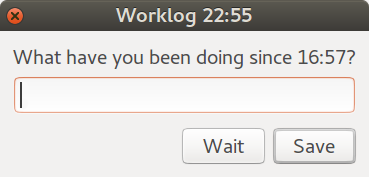

# worklog

A script that pops up a dialog every hour asking what you have spent the last
hour on.



It's sometimes annoying, but clicking wait, pressing ESC or (without typing anything) enter will make it go away for now but reappear in five minutes.

Clicking outside the window can make it get lost behind maximized windows.
To prevent it from sitting there for multiple hours the dialog closes itself
after half an hour (even if it's currently being typed into) and a new one will
appear a while after that.

If you want it to stay away for longer you can type `wait ` followed by a number
of minutes. For example, `wait 120` will make it pop up in two hours.

## Configuration / Customization

The location of the log file defaults to ~/worklog but can be passed as
a command line argument.  
Durations can be set by modifying variables near the top of the script.

### Translations

The .desktop format supports translations natively, but I don't know of a simple
way to translate bash scripts. Therefore translations of script are maintained as
branches of this repository.  
Currently the only translation is [norsk bokmål](blob/nb_NO/wlog).

## Installation

1. Copy wlog into ~/bin/ or another directory in `$PATH`.
2. Copy wlog.desktop into ~/.local/share/applications/
3. (if you want it to start automatically) copy wlog.desktop into ~/.config/autostart/

```sh
curl https://raw.githubusercontent.com/tormol/wlog/master/wlog -sS > ~/bin/wlog
curl https://raw.githubusercontent.com/tormol/wlog/master/wlog.desktop -sS > ~/.local/share/applications/wlog.desktop
cp ~/.local/share/applications/wlog.desktop ~/.config/autostart/
nohup ~/wlog >/dev/null &
```

### Dependencies

zenity, bash and GNU date  
which are all part of the default Ubuntu install.

## License

Licensed under the GNU General Public License as published by
the Free Software Foundation, either version 3 of the License,
or (at your option) any later version.  
See [LICCENSE](LICENSE) or http://www.gnu.org/licenses/ for details.
